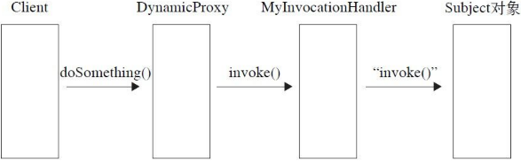

# 设计模式（一）

## 六大设计模式

### 单一职责原则

（Single Responsibility Principal, SRP）：There should never be more than one reason for a class to change.

### 里氏替换原则

（Liskov Substitution Principal, LSP）

1. 向下转型（downcast）是不安全的，行不通
2. 覆盖或实现父类的方法时输入参数可以被放大，子类方法的参数类型必须比超类的相同或宽松

### 依赖倒置原则

（Dependence Inversion Principal, DIP）：High level modules should not depend upon low level module. Both should depend upon abstaction. Abstraction should not depend upon details. Details should depend upon abstractions.

**在java中的表现就是**

* 模块间的依赖通过抽象和接口发生。实现类间不发生直接的依赖关系。
* 接口或者抽象类不依赖于实现类，实现类依赖接口或者抽象类。

**最佳实践**

* 每个类尽量有抽象类和接口
* 变量的表面类型尽量是接口或者抽象类？？
* 任何类不应该从具体类派生
* 尽量不要复写基类方法
* 应用里氏替代原则

### 接口隔离原则

1. 这里的接口是广义的，包含Object Interface，就是类；还有Class Interface，就是Interface接口
2. 原则是：客户端不应该依赖不需要的接口；类间的依赖关系应该建立在最小的接口上。换言之，建立职责单一的接口，或者说接口尽量细化，方法尽量少。
3. 根据接口隔离原则拆分接口时，首先必须满足单一职责原则。接口的设计要适度。

### 狄米特法则

（Law of Demeter, LoD）/最少知识原则（Least Knowledge Principal, LKP）：一个对象对另外一个对象应该有最少的了解。

1. 一个类只和朋友类交流。朋友类的定义是这样的：出现在成员变量、 方法的输入输出参数中的类称为成员朋友类， 而出现在方法体内部的类不属于朋友类
2. 如果一个方法放在本类中，既不增加类间关系，也对本类不产生负面影响， 那就放置在本类中。反正就是适当解耦，不能过犹不及。

### 开闭原则

一个软件实体如类、模块和函数应该对扩展开放，对修改关闭。

1. 放弃修改历史的想法吧，一个项目的基本路径应该是这样的：项目开发、 重构、 测试、 投产、 运维， 其中的重构可以对原有的设计和代码进行修改，运维尽量减少对原有代码的修改，保持历史代码的纯洁性， 提高系统的稳定性。
2. 抽象约束：
   * 通过接口或抽象类约束扩展，对扩展进行边界限定，不允许出现在接口或抽象类中不存在的public方法
   * 参数类型、引用对象尽量使用接口或者抽象类，而不是实现类
   * 抽象层尽量保持稳定，一旦确定即不允许修改
3. 元数据控制模块行为。就像写spring的配置文件，定义一个父类bean，扩展的时候再定义一个子类bean

## 单例模式

优点：

1. 可以减少内存开支，避免一些场景下对对象频繁地创建、销毁
2. 只有一个实例减少系统性能开销。一个对象产生需要比较多的资源时，如读取配置、产生其他依赖对象时，可以通过在应用启动时直接产生一个单例对象，然后永久驻留内存
3. 避免了同步问题
4. 可以在系统设置全局的访问点，优化和共享资源访问。如涉及一个单例类负责所有数据表的映射处理

缺点：

1. 一般没有接口，扩展很难
2. 对测试不利。并发环境中单例模式没有完成是不能进行测试的（看问题描述）。没有接口也不能使用mock的方式模拟对象。
3. 单例模式和单一职责原则冲突？？

一些具体使用场景

1. 要求生成唯一序列号
2. 在整个项目中需要一个共享访问或共享数据
3. 创建一个对象需要消耗资源过多
4. 需要定义大量静态常量和静态方法的环境（如工具类），当然也可以直接用static的方式

问题：

在并发量大时可能在内存出现多个实例，比如多个线程执行到if\(singleton == null\)一步，此时没有实例被创建，于是都执行singleton = new Singleton\(\)，内存中就出现两个对象了。如以下代码。解决办法：可以在getSingleton方法前加synchronized关键字。

问题：

在并发量大时可能在内存出现多个实例，比如多个线程执行到if\(singleton == null\)一步，此时没有实例被创建，于是都执行singleton = new Singleton\(\)，内存中就出现两个对象了。如以下代码。解决办法：可以在getSingleton方法前加synchronized关键字。

```text
public class Singleton { 
    private static Singleton singleton = null;
    private Singleton() {}

    public static synchronized Singleton getSingleton() {
        if (null == singleton) {
            singleton = new Singleton();
        }
        return singleton;
    }
}
```

#### 最好的方式如下：

```text
public class Singleton { 
    private static final Singleton singleton = new Singleton();
    private Singleton() {}

    public static Singleton getSingleton() {
            return singleton;
    }
}
```

另外单例不要实现Cloneable接口（一般也不会），因为实现clone方法不用调用类的构造函数，即时是私有的构造函数对象也可以被复制。

#### 另一个多单例的例子

```text
public class Singleton { 
    private static int maxNumofSingleton = 3; 
    private static ArrayList singletonNameList = new ArrayList<>(); 
    private static ArrayList singletonsList = new ArrayList<>();
    static {
        for (int i = 0; i < maxNumofSingleton; i++)
            singletonsList.add(new Singleton(i + ""));
    }
    
    private Singleton() {
    }
    
    private Singleton(String name) {
        singletonNameList.add(name);
    }
    
    public static Singleton getInstance() {
        Random random = new Random();
        return singletonsList.get(random.nextInt(maxNumofSingleton));
    }
}
```

## 工厂模式

工厂模式通用类图


```java
   ///// 抽象产品类
    public abstract class Product {
        public void method1() {// 业务逻辑处理
        }// 产品类的公共方法

        public abstract void method2();// 抽象方法
    }

    ////// 具体产品类
    public class ConcreteProduct1 extends Product {
        public void method2() {// 业务逻辑处理
        }
    }

    public class ConcreteProduct2 extends Product {
        public void method2() {// 业务逻辑处理
        }
    }

    ////// 抽象工厂类负责定义产品对象的产生
    public abstract class Creator {
        public abstract <T extends Product> T createProduct(Class<T> c);
    }

    ////// 具体工厂类实现了如何产生一个产品对象
    public class ConcreteCreator extends Creator {
        public <T extends Product> T createProduct(Class<T> c) {
            Product product = null;
            try {
                product = (Product) Class.forName(c.getName()).newInstance();
            } catch (Exception e) {
            }
            return (T) product;
        }
    }

    ///// 场景类的调用方法
    public class Client {
        public static void main(String[] args) {
            Creator creator = new ConcreteCreator();
            Product product = creator.createProduct(ConcreteProduct1.class);
        }
    }
```

优点：

1. 封装性好
2. 扩展性好
3. 屏蔽了产品类

使用场景：

1. 需要灵活、可扩展的框架
2. 异构项目
3. 可以使用在测试驱动开发的框架下，该场景已经弱化，可以直接使用JMock或者EasyMock

工厂模式的扩展：工厂模式的扩展很多，而且通常与其他模式结合使用效果更好。

### 简单工厂模式/静态工厂模式

调用简单了，但是扩展也比较困难，不符合开闭原则。主要就是去掉抽象工厂类，在具体类中去掉集成，并改为静态方法。

```java
   ////// 具体工厂类实现了如何产生一个产品对象
    public static class ConcreteCreator {
        public <T extends Product> T createProduct(Class<T> c) {
            Product product = null;
            try {
                product = (Product) Class.forName(c.getName()).newInstance();
            } catch (Exception e) {
            }
            return (T) product;
        }
    }
```

### 多工厂

可能不同类的创建差异很大，这种模式每个创建者都独立负责创建对应的产品，符合单一职责原则。但是可扩展和可维护性有一定影响，因为没扩展一个产品类都需要建立一个相应的工厂类。

```java
    ////// 抽象工厂类
    public abstract class Creator {
        public abstract Product createProduct();
    }

    ////// 具体工厂类
    public class ConcreteCreator1 extends Creator {
        public Product createProduct() {
            return new Product1();          
        }
    }
   public class ConcreteCreator2 extends Creator {
        public Product createProduct() {
            return new Product2();          
        }
    }
```

### 替代单例模式


既保证了单例，也保留了扩展性

```java
public class Singleton { // 不允许通过new产生一个对象
    private Singleton() {
    }

    public void doSomething() { // 业务处理
    }
}

public class SingletonFactory {
    private static Singleton singleton;

    static {
        try {
            // 获得无参构造
            Class<?> cl = Class.forName(Singleton.class.getName()); 
            // 设置无参构造是可访问的，getDeclaredConstructor可以访问公有私有
            Constructor<?> constructor = cl.getDeclaredConstructor();             
            constructor.setAccessible(true); // 产生一个实例对象
            singleton = (Singleton) constructor.newInstance();
        } catch (Exception e) { // 异常处理
        }
    }

    public static Singleton getSingleton() {
        return singleton;
    }
}
```

### 延迟初始化

\(Lazy initialization\)一个对象被消费完毕后，并不立即释放，工厂类保持其初始状态，等待再次被使用


```java
public class LazyFactory {
    private static final Map<String, Product> prMap = new HashMap();

    public static synchronized Product createProduct(String type) throws Exception {
        Product product = null; // 如果 Map 中 已经 有这 个 对象
        if (prMap.containsKey(type)) {
            product = prMap.get(type);
        } else {
            if (type.equals(" Product1")) {
                product = new ConcreteProduct1();
            } else {
                product = new ConcreteProduct2();
            } // 同时 把 对象 放到 缓存 容器 中
            prMap.put(type, product);
        }
        return product;
    }
}
```

延迟加载框架可以扩展，例如通过判断Map中已有对象的数量来限制最大实例化数量，如JDBC连接数据库。

延迟加载还可以用在对象初始化比较复杂的情况，如硬件访问、涉及多方面的交互，用延迟加载来降低对象的产生和销毁带来的复杂性。

## 抽象工厂模式

（Abstract Factory Patten）

定义：为创建一组相关或相互依赖的对象提供一个接口，而且无须制定他们的具体类。


```java
public abstract class AbstractProductA { // 每个 产品 共有 的 方法
    public void shareMethod() {
    } // 每个 产品 相同 方法， 不同 实现

    public abstract void doSomething();
}

public class ProductA1 extends AbstractProductA {
    public void doSomething() {
    }
}

public class ProductA2 extends AbstractProductA {
    public void doSomething() {
    }
}

public abstract class AbstractCreator {
    // 创建A产品家族
    public abstract AbstractProductA createProductA();

    // 创建B产品家族
    public abstract AbstractProductB createProductB();
}

public class Creator1 extends AbstractCreator {
    // 只生产产品等级1的A产品
    public AbstractProductA createProductA() {
        return new ProductA1();
    }

    // 只生产产品等级1的 B产品
    public AbstractProductB createProductB() {
        return new ProductB1();
    }
}

public class Creator2 extends AbstractCreator {
    // 只生产产品等级2的A产品
    public AbstractProductA createProductA() {
        return new ProductA2();
    }

    // 只生产产品等级2的B产品
    public AbstractProductB createProductB() {
        return new ProductB2();
    }
}

/// 场景
public static void main(String[] args) {
    AbstractCreator creator1 = new Creator1();
    AbstractProductA a1 = creator1.createProductA();
}
```

和工厂方法不同，在场景中，只需知道工厂方法就可以直接产生一个产品对象，无须关心实现类。

**优点**

1. 封装性。高层模块不需要关心产品的实现类，而是接口和抽象；创建由工厂类负责。只需要知道工厂类就可以创建一个需要的对象。
2. 产品族内的约束为非公开状态。比如要调整产品之间的比例，可以在抽象工厂模式中增加一个产生对象数量的约束，这样的生产过程对调用工厂类的高层模块来说是透明的，它不需要知道这个约束，我就是要一个产品就可以了，具体的产品族内的约束是在工厂内实现的。

**缺点**

产品族纵向扩展困难，工厂的抽象类和实现类都需要修改。横向扩展，比如增加一个产品，相应增加一个工厂类负责新增的产品生产任务即可，扩展相对容易。

**使用场景**

一个对象族有相同额约束，可以使用抽象工厂模式。

## 模板方法模式

（Template Method Pattern）

定义：定义一个操作中的算法的框架，而将一些步骤延迟到子类中。使得子类可以不改变一个算法的结构即可重定义该算法的某些特定步骤。


```java
public abstract class AbstractClass { 
    // 基本方法
    protected abstract void doSomething();
    protected abstract void doAnything(); 
    // 模板方法
    public void templateMethod() { // 调用基本方法，完成相关的逻辑
        this.doAnything();
        this.doSomething();
    }
}

public class ConcreteClass1 extends AbstractClass { // 实现基本方法
    protected void doAnything() {} // 业务逻辑处理
    protected void doSomething() {} // 业务逻辑处理
}

public class Client {
    public static void main(String[] args) {
        AbstractClass class1 = new ConcreteClass1();
        // 调用模板方法
        class1.templateMethod();
}
```


模板方式非常简单，仅仅用了Java的集成机制。AbstractClass分为基本方法和模板方法：

* 基本方法：由子类实现，在模板方法中被调用。尽量设计为protected，符合Demeter法则，不需要暴露的方法或属性不设置为protected。实现类若非必要，尽量不要扩大父类中的访问权限。
* 模板方法：实现对基本方法的调度，完成固定逻辑。为了防止恶意操作，一般模板方法加上final

**优点**

* 封装不变部分，扩展可变部分
* 提取公共部分的代码便于维护
* 行为由父类控制子类实现

**缺点**

一般设计习惯是抽象类负责最抽象的属性和方法，实现类完成具体事物和属性，但模板方法模式颠倒了。子类的执行结果会影响父类，在复杂项目中带来代码阅读的困难。

**使用场景**

* 多个子类有公有的方法而且基本逻辑相同
* 重要、复杂的算法，核心算法设计为模板方法，细节由各个子类实现
* 重构时相同代码抽取到父类中，通过增加钩子函数（比如判定后改变类的行为）约束行为
* 使用模板方法模式扩展方便，许多开源项目应用，比如提供一个抽象类，需要扩展功能，可以集成这个抽象类，复写protected方法，然后调用类似execute方法就完成扩展开发。

## 建造者模式

（Builder Patter）也叫生成器模式

定义：将一个复杂对象的构建与它的表示分离，使得同样的构建过程可以创建不同的表示。


```java
public class Product {
    public void doSomething() { // 业务处理
    }
}

public abstract class Builder {
    // 设置产品的不同部分
    public abstract void setPart();

    // 建造产品
    public abstract Product buildProduct();
}

public class ConcreteProduct extends Builder {
    private Product product = new Product();

    public void setPart() {
    }// 产品类内的逻辑

    public Product buildProduct() {
        return product;
    }
}

public class Director {
    private Builder builder = new ConcreteProduct();

    public Product getAProduct() {
        builder.setPart();
        return builder.buildProduct();
```

**优点**

* 封装性：Client不知道Product的细节
* 扩展性：Builder之间独立，便于扩展
* 风险性：具体的建造者彼此独立，可以对建造过程逐步细化，不对其他模块产生任何影响

**使用场景**

* 相同方法不同执行顺序产生不同时间结果
* 多个部件或者零件都可以装配到一个对象中，但是产生的结果不相同时

与工厂模式最大的不同，建造者模式关注零件类型和装配工艺（顺序）。工厂方法里面，Product和Factory是相对独立的，Factory重在创建，而不是组装顺序。

导演类避免了高层模块深入到建造者内部的实现类。产品类也可以结合前面的模板方法创建（零件）。

## 代理模式

（Proxy Pattern）也叫委托模式

定义：为其他对象提供一种代理，以控制对这个对象的访问。


（原话）其他模式如状态模式、策略模式、访问者模式本质上实在更特殊的场合采用了委托模式。在一些著名开源软件中也经常见到它的身影，如Struts2的Form元素映射就采用了代理模式（准确地说是动态代理模式）。

Subject是抽象类或者接口，是最普通的业务类型定义。

RealSubject是被委托的角色，业务逻辑的具体执行者。

Proxy是委托类，把所有抽象类定义的方法限制都委托给RealSubject实现，并在其处理完毕前后做预处理和善后工作。

```java
public interface Subject {
    void request();
}

public class RealSubject implements Subject {
    public void request() {
        // do something
    }
}

public class Proxy implements Subject {
    private Subject subject = null;

    public Proxy() {
        this.subject = new Proxy();
    }

    public Proxy(Subject... subjects) {
        // 通过构造函数传递代理者
    }

    public void request() {
        this.doBefore();
        subject.request();
        this.doAfter();
    }

    private void doBefore() {
    }

    private void doAfter() {
    }
}
```

这里普通代理是我们要知道代理的存在，才能访问；强制代理是调用者直接调用真实角色，不用关心代理是否存在。下面以书的类图例子对比。

### 普通代理

对比上面例子的类图只改变了构造函数。这种模式下调用者只知道代理，不知道真实角色，而经典方法是用了代理和真实角色。


### 强制代理

真实角色必须指定代理才能访问，高层调用真实角色的getProxy\(\)获取代理然后访问，即代理的管理由真实角色来。


### 代理接口

通过接口进一步扩展代理。代理类可以代理多个真实角色（职责可以不单一），可以为真实角色预处理消息、过滤消息、消息转发、事后处理消息等。

### 动态代理

动态代理实在运行阶段才制定代理对象。面向切面编程（AOP）核心是采用动态代理机制。


动态代理实现代理的职责，业务逻辑Subject实现相关的逻辑功能，两者之间没有必然的相互耦合的关系。通知Advice从另一个切面切入，最终在高层模块也就是Client进行耦合，完成逻辑的封装任务。



```java
public interface Subject {
    void doSomething(String str);
}

public class RealSubject implements Subject {
    @Override
    public void doSomething(String str) {
    };
}

public class MyInvocationHandler implements InvocationHandler {
    // 被代理的对象
    private Object target = null;

    public MyInvocationHandler(Object _obj) {
        this.target = _obj;
    }

    @Override
    public Object invoke(Object proxy, Method method, Object[] args) throws Throwable {
        return method.invoke(this.target, args);
    }
}

public class DynamicProxy<T> {
    public static <T> T newProxyInstance(ClassLoader loader, Class<?>[] interfaces, InvocationHandler h) {
        // 寻找JoinPoint连接点，AOP框架使用元数据定义
        if (true) {
            // 执行前置通知
            (new BeforeAdvice()).exec();
        }
        return (T) Proxy.newProxyInstance(loader, interfaces, h);
    }
}

public interface IAdvice {
    public void exec();
}

public class BeforeAdvice implements IAdvice {
    public void exec() {
    }

    public class Client {
        public static void main(String[] args) {
            Subject subject = new RealSubject();
            InvocationHandler handler = new MyInvocationHandler(subject);
            Subject proxy = DynamicProxy.newProxyInstance(subject.getClass().getClassLoader(),
                    subject.getClass().getInterfaces(), handler);
            proxy.doSomething(" Finish");
        }
    }
}
```

## 原型模式

实现Cloneable接口

实现clone时候构造函数是不会被执行的

## 观察者模式

（Observer Pattern）也叫发布订阅模式。

定义对象间一种一对多的依赖关系，使得每当一个对象改变状态，则所有依赖于它的对象都会得到通知并被自动更新。）

书中的类图例子：


通用类图：


```java
// JDK的Observer
public interface Observer {
    void update(Observable o, Object arg);
}

// JDK的Observable
public class Observable {
    private boolean changed = false;
    private Vector<Observer> obs;

    public Observable() {
        obs = new Vector<>();
    }

    public synchronized void addObserver(Observer o) {
        if (o == null)
            throw new NullPointerException();
        if (!obs.contains(o)) {
            obs.addElement(o);
        }
    }

    public synchronized void deleteObserver(Observer o) {
        obs.removeElement(o);
    }

    public void notifyObservers() {
        notifyObservers(null);
    }

    public void notifyObservers(Object arg) {
        Object[] arrLocal;

        synchronized (this) {
            if (!changed)
                return;
            arrLocal = obs.toArray();
            clearChanged();
        }

        for (int i = arrLocal.length - 1; i >= 0; i--)
            ((Observer) arrLocal[i]).update(this, arg);
    }

    public synchronized void deleteObservers() {
        obs.removeAllElements();
    }

    protected synchronized void setChanged() {
        changed = true;
    }

    protected synchronized void clearChanged() {
        changed = false;
    }

    public synchronized boolean hasChanged() {
        return changed;
    }

    public synchronized int countObservers() {
        return obs.size();
    }
}

public class ConcreteObservable extends Observable {
    public void doSomething() {
        // doSomething
        super.notifyObservers();
    }
}

public class ConcreteObserver implements Observer {
    @Override
    public void update(Observable o, Object arg) {
    }
}

```

**缺点**

消息通知默认是顺序执行，一个观察者卡壳会影响整体执行效率；这种情况考虑采用异步的方式。

多级触发的效率让人担忧

**注意事项**

广播链问题：如果观察者本身也是被观察者（消息转发），逻辑复杂难以维护；建议消息最多转发一次

异步：观察者较多，考虑异步，看Message Queue

## 适配器模式

Adapter Pattern。贫血对象，对象不储存实体状态以及对象之间的关系；反之就是充血对象


**Adaptee是已存在的正常运作的类**，Adapter扩展Adaptee并implement Target接口，把两个不相关的类结合起来

使用场景：这是一种**补偿模式**，主要用在系统扩展，尤其是想扩展已经投产的接口。详细设计阶段不要考虑。

## 责任链模式

使多个对象都有机会处理请求，从而避免了请求的发送者和接受者之间的耦合关系。将这些对象连成一条链，并沿着这条链传递该请求，直到有对象处理它为止。


```java
public class Response {
}

public class Request {
    public Level getRequestLevel() {
        return null;
    }
}

public class Level {
}

public abstract class Handler {
    private Handler nextHandler;

    // 处理请求
    public final Response handleMessage(Request request) {
        Response response = null;
        // 判断时候自己的处理级别
        if (this.getHandlerLevel().equals(request.getRequestLevel())) {
            response = this.echo(request);
        } else {
            if (this.nextHandler != null) {
                response = this.nextHandler.handleMessage(request);
            } else {// 没有合适的处理者，业务自行处理
            }
        }
        return response;
    }

    public void setNext(Handler handler) {
        this.nextHandler = handler;
    }

    protected abstract Level getHandlerLevel();

    protected abstract Response echo(Request request);
}

public class ConcreteHandler1 extends Handler {
    @Override
    protected Level getHandlerLevel() {
        return null;
    }

    @Override
    protected Response echo(Request request) {
        return null;
    }
}

public class ConcreteHandler2 extends Handler {
    @Override
    protected Level getHandlerLevel() {
        return null;
    }

    @Override
    protected Response echo(Request request) {
        return null;
    }
}

// 场景类，一般都有进一步的封装，返回责任链中的第一个处理者
public class Client {
    public static void main(String... args) {
        Handler handler1 = new ConcreteHandler1();
        Handler handler2 = new ConcreteHandler2();
        handler1.setNext(handler2);
        Response response = handler1.handleMessage(new Request());
    }
}
```

优点：请求和处理分开

缺点：

1. 性能：请求从链头遍历到链尾
2. 采用类似递归的方式，调试比较困难

事项：

避免超长链的情况，一种做法是在Handler中设置一个最大节点数量，setNext中判断是否超过与之，避免无意识破坏性能。


